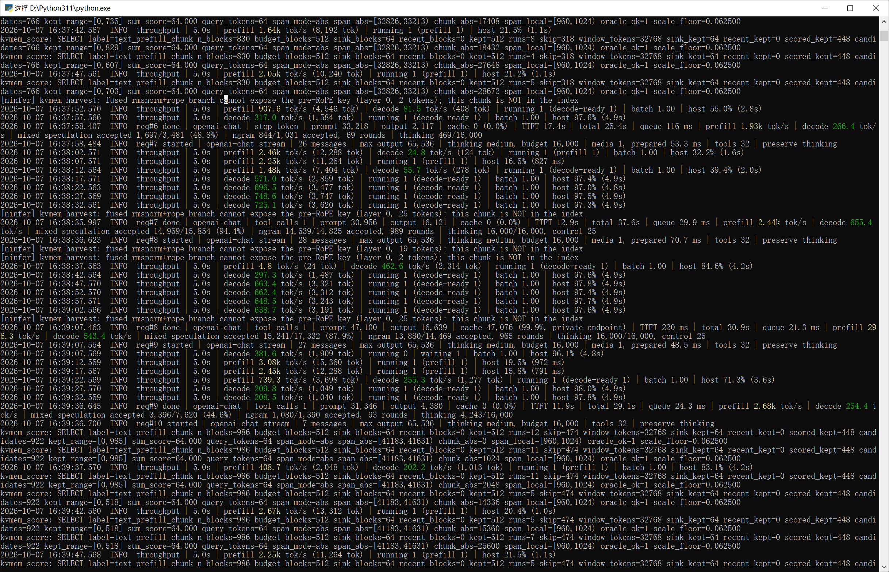

# Bonsai-27B-NInfer-kvmem — 官方线（NInfer v0.11.0 + KVMem 环）部署工程

> 在 **RTX 5080（16GB，sm_120a）** 上把 **Bonsai-2-27B 三元量化模型**（官方制品 `Ternary-Bonsai-2-27B-ninfer-v3.ninfer`）与 **官方 NInfer v0.11.0 + KVMem 环引擎**（`ninfer-serve-120a.exe`）跑通、并做 KVMem 长上下文检索验证与自编扩展的完整工程记录。
> 本仓库为**私有库**（`paicat1/Bonsai-27B-NInfer-kvmem`），**非官方发布方**；名字里的 "kvmem" 只表示本线血统，避免与上游官方产物混淆。

---

## 这个仓库怎么用（两分支一体）

一个仓库、两个分支，**配合起来才是一个完整项目**：

| 分支 | 角色 | 内容 |
|---|---|---|
| **`main`**（本分支） | **项目层** | 启动器、起服 BAT、构建史 / 报告 / 方案文档、日志工具 |
| **`engine-main`** | **引擎层** | 官方 NInfer v0.11.0（+ KVMem 环）完整 C++/CUDA 源码 + 本项目 MSVC 编译补丁 + Design C 补丁（可复现构建） |

- 要看**引擎代码、改了哪些补丁、怎么重编** → 切到 `engine-main`，读它的 `README.md`（复现索引）。
- 要看**整个项目怎么跑起来、历史、报告、档位** → 留在 `main`，读下面的目录导航。

> 引擎成品 `ninfer-serve-120a.exe`、模型制品、上游全库 clone 均**不入库**（体积 / 上游内容，见 `.gitignore`）；只收"本线产品本身"（部署文档 / 方案 / 报告 / 启动器配置）。

## 双线背景（为什么有这一条官方线）

- **官方线**（本仓，`J:\Bonsai-Official`）：基于 **UP主沈三殊（shensanshu）** 发布的**三元 Bonsai 成品引擎包** `infer-engine-sm120a-20261002`（原生 sm_120a 引擎 + 三元 v3 制品），**不混编、不改引擎**——只跑、只验证、按需自编。
  - ⚠️ **"官方"指谁**：此**成品整包（引擎 + 三元 v3 制品）是由三元 Bonsai 作者沈三殊（UP主）发布的**，**不是** NInfer 作者（Neroued）发的，**也不是** KVMem 环作者（1314521gjy）发的——后两者是**内核 / KVMem 环的上游血统**。
- **自建线**（另一项目，`J:\Bonsai`）：既有 Ambolio v1.0.8 移植树 + 自产 v2 制品的冻结对照。
- 两线**完全隔离、彼此验证**（用户 2026-10-06 裁决"双线并行"）。**本仓不掺和、不管理、不优化自建线**；自建线仅按需临时拉起当 A/B 对照基线。

## 快速上手（起服）

三种方式，任选其一：

1. **GUI 启动器**：运行 `ninfer_launcher.py`（或双击 `启动器.bat`）——下拉配置上下文 / KV 类型 / KV 容量 / 投机档 / 思考预算 / 视觉 / 并发等，右侧实时预览启动命令，一键起服（**新控制台窗口运行，关窗 = 停服**），并可「环境自检」「就绪自测」。内置 6 个场景预设。
2. **官方 BAT**：双击 `start-pq2-dflash.bat`（PQ2 全量档，端口 8094，`--spec dflash2 --lm-head-draft --vision`）——官方原样命令，改路径即用。
3. **手动**：`engine\ninfer-serve-120a.exe models\Ternary-Bonsai-2-27B-ninfer-v3.ninfer --host 127.0.0.1 --port 8094 ...`。

> ⚠️ **serve 的启停一律由用户双击完成**，本工程**不主动用隐藏窗口拉起**——"关窗 = 停服"的心智模型不能被后台进程破坏。

### 运行前提（两笔账：显存 + 主机内存）

- **显存**：引擎 + KV 池 + 视觉塔需占相当显存；起服前建议腾出 **~13 GiB**。显存紧时先摘 `--vision`、再降 KV 精度。
- **主机内存**：引擎启动会锁定 **pinned（不可换出）主机内存**（host state + host KV，默认 `--host-kv-mib 16384`）。本机内存充足从未触发，但**内存紧张机器可能在启动阶段失败**（报错对着 host KV，易与文档对不上）。降配：`--host-kv-mib 8192` / 调小 host state。

### 5080 专属注意

官方内置档位表**无 5080**，首次启动的 `calibrating routes` 会花 **10–50s**，**别杀**。

## 项目结构（本地 = 库）

> 下表 = **本地实际结构**；标 **✅入库** 的随库分发，标 **❌不入库** 的因体积/上游原因忽略（clone 后需自行获取或按 `build/` 复现）。**外人 clone 即懂结构。**

| 路径 | 入库 | 内容 |
|---|---|---|
| `ninfer_launcher.py` / `启动器.bat` | ✅ | GUI 启动器（参数下拉 + 命令预览 + 起服 + 自检/就绪自测 + 命名组合 + **「引擎」下拉：官方成品 / 自编 Design C**） |
| `serve_tee.py` | ✅ | 日志转存（着色 + 精简/全部；全文落盘 `logs\serve_<时间戳>.log`） |
| `start-pq2-dflash.bat` / `start-pq2.bat` / `start-ptq1-mtp.bat` | ✅ | 官方三档启动器 |
| `start-pq2-dflash-designc.bat` | ✅ | **自编引擎（Design C）对照启动器** |
| **`build/`** | ✅ | **自编引擎的构建 / 复现材料**（构建脚本 + 复现说明：依赖、步骤、要改的路径） |
| `README.md` / `docs/` | ✅ | 项目层文档（构建史 / 报告 / 教程） |
| `ninfer_launcher_profiles.json` | ✅ | 启动器命名组合（含实跑档） |
| **`engine/`** | ❌ 体积 | 引擎成品：`ninfer-serve-120a.exe`=**官方成品**；**`self-built/ninfer-serve.exe`=我们自编的引擎（含 Design C）+ 全套运行 DLL** |
| `models/` | ❌ 体积 | 模型制品 `Ternary-Bonsai-2-27B-ninfer-v3.ninfer` |
| `official-repo/` | ❌ 上游 | 上游全库 clone（引擎源码，复现输入） |
| `logs/` | ❌ | 运行日志（含 `kvmem_score` 检索证据） |
| `.temp/` | ❌ | **仅临时中间物**（草稿 / 一次性脚本 / 日志；**严禁放成果**——见铁律 T-NO-TEMP-WORK） |
| `_safety_backups/` | ❌ | 备份快照 |

**别人 clone 后怎么用**：① 按 `build/README.md` 复现出**自己的引擎**（或获取 `engine/`、`models/`）；② 在启动器里选「引擎」= 自编 / 官方 → 起服。

## 关键结论（速览）

### 引擎 / 模型真值（施工前必核）

| 项 | 值 |
|---|---|
| 引擎 | `engine\ninfer-serve-120a.exe` = `E3E0486A…` / **1,329,240,576 B**（GitHub Release asset digest 交叉验证同源） |
| 模型 | `models\Ternary-Bonsai-2-27B-ninfer-v3.ninfer` = **9,520,051,456 B** / SHA256 `CDC4810B0FF17C40D0F62CF214B6E0BCD08346E9EB05CA53371507037793C14A` |
| 上下文 | 官方默认 **262144**（256K） |
| KV 池 | 官方默认 **17920** token（设备池） |

> ⚠️ 官方包导读写 `42CD0735…` / 1,343,609,856 B 的是**修复前旧包**的 hash，勿照用。

### KVMem 机制要点

- **KVMem 环 = 显存小池 + 主机内存大盘卸载**（本线相对自建线的关键差异）：`--kv-capacity` 可**小于**上下文，超出设备池的 KV 分页下放主机内存，靠**内容打分检索**决定哪些块常驻。
- **五环境变量必设**（缺一 = 起得来但**静默答错**）：`NINFER_KV_WINDOW` / `NINFER_KV_RETRIEVE` / `NINFER_KV_RING` / `NINFER_HOST_PAGEABLE` / `NINFER_KV_REUSE_HOSTBACKED`（启动器自动注入）。
- **内容打分默认 ON**；判活看日志 `kvmem_score: SELECT …` 行（无 = 打分没跑）。
- **口径陷阱**：官方 docs 分"当前 / 历史"两批，读错必误判。

### 实测（本机 5080）

- **S1–S2**：起服监听 `127.0.0.1:8094`；`GET /v1/models` 200 + **真发一条请求** 200（判活必须真发请求，`/v1/models` 200 ≠ 健康）。
- **S4 长文检索三层判据**（G14）：正文埋针 + **问句独立成回合** ⇒ 问句 span ≤ `MAXQ=256` ⇒ 打分真跑（`scored_kept>0`）、针被答出、kept 覆盖针位。
- **S5 同口径 A/B（数数字 / 中文散文 / 英文散文）**：**同一 dflash 档下，数数字接受率 91.5%（92%）而散文骤降到 3.7%（中）/13.4%（英）** ⇒ 官方"decode 高"**仅对数数字语料成立**；散文差距本质是**语料效应**（接受率是强内容依赖指标，不能用合成填充文本测）。
- **S5 判决（H2）**：同语料同 draft 口径下，官方原生**并未显著优于**自建当前配置（散文两组自建接受率反超）。
- **S6 自编 120a**：官方源码**全树 MSVC 构建成功**（3 类编译补丁），并打上 **Design C** 补丁——对"思考区空正文"给出自编侧解法；双 exe 探针实测：**自编 serve 的思考预算生效（稳定输出正文），官方成品不解析该字段**。
- **真实负载实跑（2026-10-07，19 请求，32 工具对话）**：档位 **dflash2 K=7 + 思考预算 16000**，KV 163,840 **全驻显存**（free 0.84 GiB）。**瞬时峰值 decode 748.6 tok/s**（> 官方验收 571.9）；请求级 decode 180–655、**mixed speculation 接受率 35.7–94.4%**（长输出 ngram 命中 ≈98%）；续写缓存 99.9–100%、TTFT 0.18–0.29 s。⇒ 真实工具负载同样能跑高——**关键在 K=7 + ngram 混合投机**（非"只能数数字"）。口径：serve 运行中所记单请求/瞬时值，聚合未收尾。
- **预填充极值 3,820 tok/s**（2026-10-07 **新配置** `--kv-dtype nvfp4 --max-context 229376 --kv-capacity 229376`，KV 全驻）：`req#2 done | prompt 8,979 | prefill 3.82k tok/s` —— **全区间最高**（今日各日志极值 `3,820 / 3,780 / 3,760 / 3,630 / 3,080 / 2,860`）。

### DFlash2 深度与语料

- **dflash 深度收益强依语料**：数数字（可预测）K 越深越快（K4 322 → K12 654 tok/s，+103%）；散文（不可预测）**K=7 最优**，K12 反而略降 ⇒ 与官方教程"不可预测输出 draft 12 更慢"逐字吻合。
- **K=7 = 日常甜点（真实负载验证）**：真实工具对话用 **dflash2 K=7 + ngram 混合投机** → 接受率 35.7–94.4%、decode 峰值 748.6；而 **d12 + 纯 dflash** 同场景接受率仅 ~22.7%。⇒ 与官方"**K≥10 断崖、K=7 最优**"一致；**日常建议 K=7**（启动器默认 `d12` 是首起/上限档）。

### 思考预算

- `--default-thinking-budget N`（服务端 argv 级）治"**思考墙死循环**"（思考烧光输出预算 → 空正文）。⚠️ **OpenAI chat 端点不解析请求体里的 `thinking_budget`**（仅 Anthropic 的 `thinking.budget_tokens` 被读），只能靠服务端此参数（启动器「思考预算」档）。

## 鸣谢（上游作者）

本项目站在上游作者肩上落地，致谢：

- **Neroued**：NInfer 官方上游作者（C++20/CUDA）。[`Neroued/ninfer`](https://github.com/Neroued/ninfer)
- **沈三殊（shensanshu）· UP主**：**三元-Bonsai 作者**——发布三元 Bonsai 论文 / 工具链（[`shensanshu/ninfer-ada-ternary`](https://modelscope.cn/models/shensanshu/ninfer-ada-ternary)，ModelScope）**及本线所用的"三元 Bonsai 成品引擎包"（`infer-engine-sm120a-20261002`）与三元 v3 制品**，是本项目官方线的**成品发布方**。
- **1314521gjy**：本线引擎血统来源 `ninfer-fusion-kvmem`（NInfer v0.11.0 基座 + KVMem 环融合）。
- **ashalliants / Warlax / TertiumOrganum1 / UDPSendToFailed / IMGillusion** 等 NInfer 整合线与各 fork 作者：官方引擎的整合与内核贡献者。
- **模型根基**：Qwen Team 架构 + unsloth NVFP4 量化 + z-lab DFlash 权重。

## 分支说明

本 `main` 分支承载**项目层**（启动器 / 起服 BAT / 构建史 / 报告 / 日志工具）；引擎源码与补丁在 **`engine-main`** 分支（含复现索引 README）。两分支配合使用。
